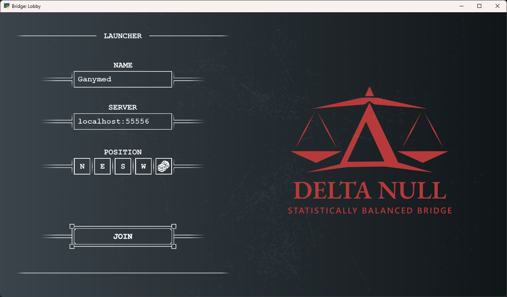
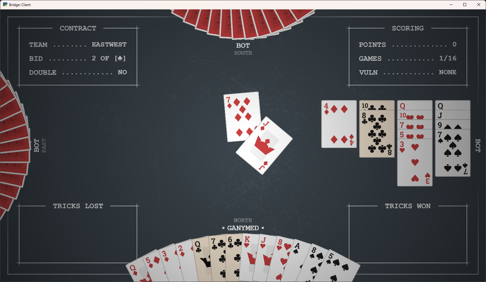
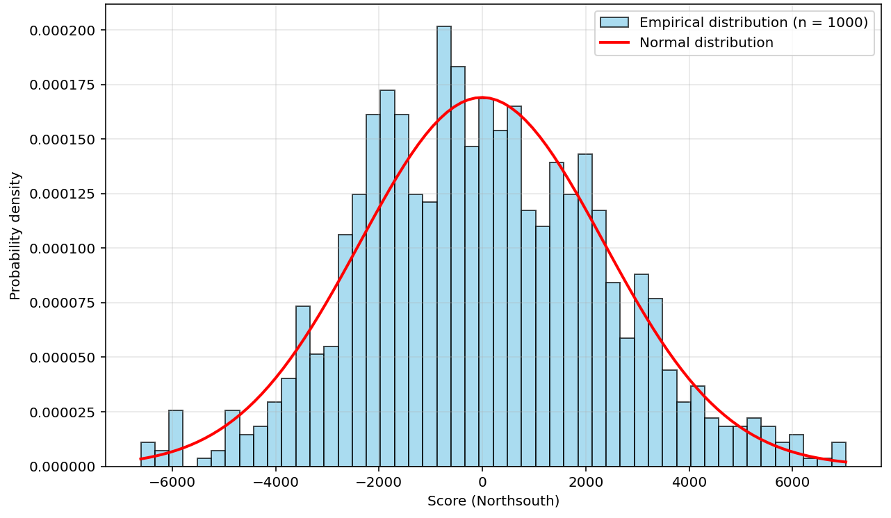
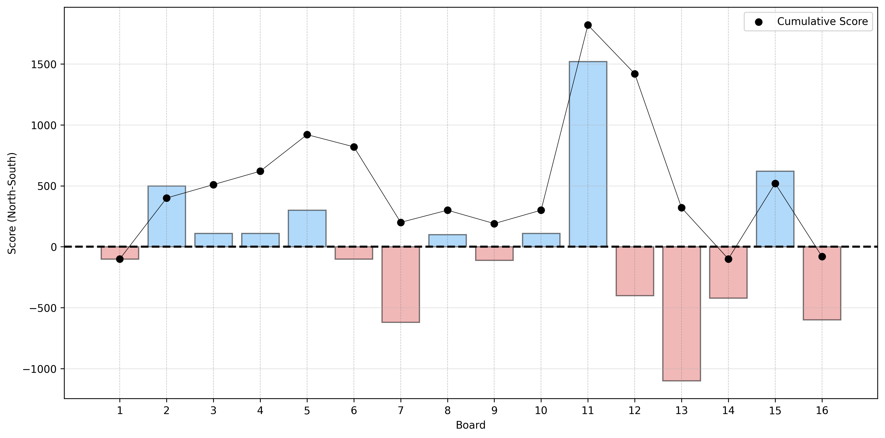

# Delta Null

**Delta Null** is a multiplayer bridge card game developed in Python using the Python Arcade Library.
The game is designed as a peer-to-peer experience without a central online lobby or matchmaking system. Instead, one player hosts a session locally, while the remaining players connect directly as clients, enabling private games among friends.

The key feature of the program is the generation of balanced deals through constrained sampling of hands, ensuring that the net score, as estimated by Double Dummy analysis, is biased toward averaging to zero across a session.

Although the game can be played with bots (which are very rudimentary), it is intended primarily as a PvP experience. The game follows standard bridge rules with four players using Chicago scoring system.

Launcher:



Gameplay:



Dealer and vulnerability follow a standard rotation. Any number of deals can be played, but sessions of 16 deals are recommended so that all dealer-vulnerability combinations are represented evenly.
16-deal session example:

| Block   | Dealer: North | Dealer: East | Dealer: South | Dealer: West |
|---------|---------------|--------------|---------------|--------------|
| 01–04   | None          | North-South  | East-West     | Both         |
| 05–08   | North-South   | East-West    | Both          | None         |
| 09–12   | East-West     | Both         | None          | North-South  |
| 13–16   | Both          | None         | North-South   | East-West    |

## Motivation

Unlike tournament bridge, which inherently mitigates the impact of luck through duplicate scoring, casual bridge does not offer such a correction. After an evening of play, one partnership often leaves feeling they had no realistic chance to win due to poor card distribution, regardless of how well they played.

This perception can be supported statistically. The figure below shows the expected net score distribution of 16-hand sessions, based on Double Dummy analysis of 1'000 randomly generated sessions. The standard deviation is approximately 2'400 score points — a substantial variance for casual players who play only a few sessions per year.

Double Dummy analysis represents perfect play with complete information and does not necessarily correspond to the best play achievable by human players with limited information. However, analysis of publicly available online databases shows that it provides a good heuristic — in particular, Double Dummy results predict the average number of tricks achieved by expert players reasonably well.



The program therefore constrains deal sampling such that, over a game session (i.e. a predefined number of hands), the expected net score is approximately zero. The target is intentionally approximate rather than exact to avoid overly restrictive sampling. An example 16-hand session is shown below.

Importantly, other bridge statistics (slam probabilities, suit distributions, etc.) remain unaffected by this constraint.



## Project Structure

```
bridge/
├── assets/          # Finalized images, sounds, and media files used directly in the game
├── sources/         # Working files (e.g., Inkscape .svg files and other editable sources)
├── docs/            # Documentation, concept notes, and related materials
├── cardserver.py    # Server-side script
└── cardclient.py    # Client-side script
```

## Getting Started

### Prerequisites

- Python ≥ 3.10
- Python library: Arcade ≥ 3.1
- Python library: NumPy ≥ 2.2
- Python library: Pyperclip ≥ 1.9

### Installation

Open terminal (Linux/macOS) or command prompt (Windows) in the directory where you want to clone the project. Then:

1. Clone the repository:
   ```bash
   git clone https://github.com/Ultimatthi/bridge-delta-null
   cd bridge-delta-null
   ```
2. Install a Python runtime environment: [https://www.python.org/](https://www.python.org/)

3. Install required dependencies:
   ```bash
   pip install arcade
   pip install numpy
   pip install pyperclip
   ```

### Network Setup

- **Local network (LAN)**: Players can connect directly using the host's local IP address
- **Online play**: The host must configure port forwarding on their router (default port: 55556)
- **Alternative**: Use virtual LAN solutions like Hamachi or ZeroTier

### Running the Game

1. Start the server (only 1 player, acting as host):
```bash
   python cardserver.py
```
2. Start the client (all 4 players, including the host):
```bash
   python cardgame.py
```
3. Join the game session by connecting to the server at `<host-ip>:<port>`
   - For local network: Use the host's local IP address (e.g., "192.168.1.50:55556")
   - For online play: Use the host's public IP address (e.g., "88.214.164.224:55556")

## License
This project is licensed under the MIT License — see the LICENSE file for details.

## Contributing

Contributions, bug reports, and feature suggestions are welcome!

---

*Made with ❤️ using Python and Arcade.*

